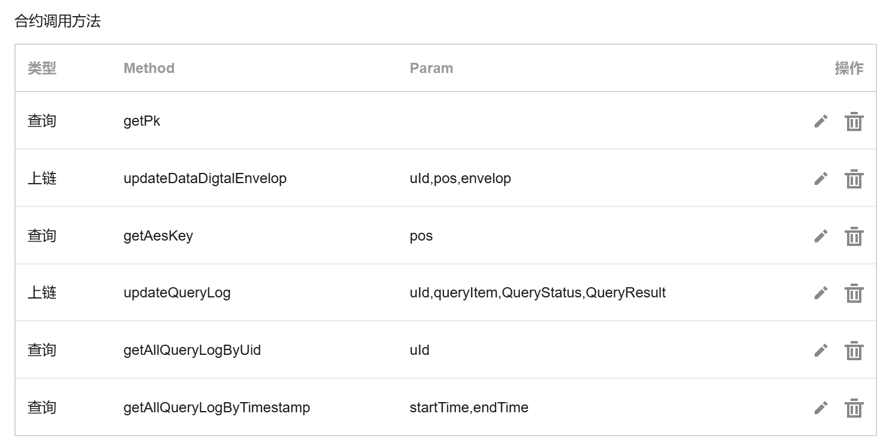
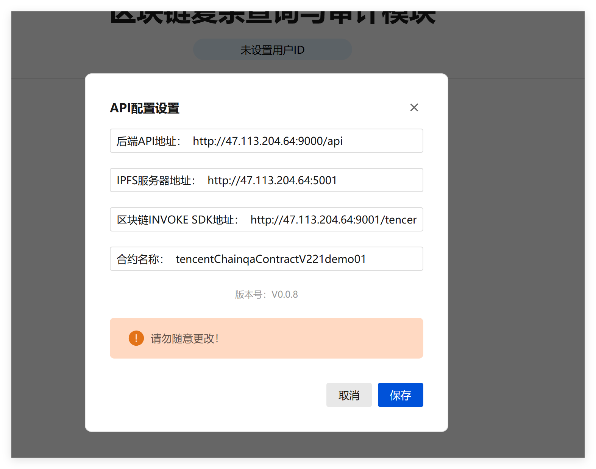

# ChainQA4chainmaker

简体中文 | [English](./README-en.md)

面向腾讯云部署的[长安链](https://chainmaker.org.cn/home)（V2.2版本）的ChainQA（区块链审计与查询平台）

## 项目介绍

ChainQA 是一款基于区块链和 IPFS 技术，集数据加密存储、高效查询、审计功能于一体，旨在解决数据安全与隐私保护问题的组件。

用户只需上传符合既定格式要求的表格文件，ChainQA 便会自动将其加密后存储于 IPFS 中，同时把相应的密钥妥善存放在区块链上。对于数据的查询，当上传者分享 IPFS 地址后，其他用户即可发起查询操作，此时在区块链内部完成解密流程，返回查询结果，加密密钥全程不泄露。所有查询操作均会被记录，可随时按照查询账号或时间范围对查询操作进行审计溯源。

ChainQA 支持多条件、联表查询功能，用户能够灵活、精准地获取所需数据。此版本仅需查询者获取 IPFS 地址即可查询，可自主进行二次开发，增加例如查询密码等辅助功能。

## 项目架构

### 项目主体架构

- back：后端代码，主要处理IPFS加解密、转换Excel数据、封装请求等基础操作
- front：前端代码，页面展示
- contract：部署在[腾讯云长安链](https://console.cloud.tencent.com/tbaas/chainmaker/chain/chainmaker-demo/basicInfo?chainId=1&demo=1)的合约代码， **请注意此合约代码仅适配长安2.1~2.2版本** 。
- doc：一些可用于测试的文档（excel）、一些图片、以及一些帮助文档
- tencent-chainmaker：用于链通后端与腾讯云区块链的SDK。**需进行配置**。
- docker-compose.yml：用于启动docker的docker编排文件。

### 后端（Back）

👋如只是 **单纯体验后端**，请按如下方式运行：

安装依赖包：

```bash
go mod vendor
```

运行：

```bash
go run main.go
```

后端监听9000端口。

👋如想部署**整个项目**，请参见部署章节。

### 前端（front）

👋如只是 **单纯体验前端**，请按如下方式运行：

需提前安装node、yarn。

运行(前端调试环境下)：

```bash
yarn dev
```

👋如想部署 **整个项目** ，请参见部署章节。

### 区块链智能合约（contract）

位于contract文件夹下。

其中 `tencentChainqaContractV221demo01.7z`为编译后的版本。`src`为源代码文件夹。

> 请注意本文件的合约代码仅适配长安2.1~2.2版本，可部署至[腾讯云长安链](https://console.cloud.tencent.com/tbaas/chainmaker/chain/chainmaker-demo/basicInfo?chainId=1&demo=1)

合约名建议为：`tencentChainqaContractV221demo01`（否则需要在前端更改合约名）



### tencent-chainmaker

主要是后端与 [腾讯云长安链](https://console.cloud.tencent.com/tbaas/chainmaker/chain/chainmaker-demo/basicInfo?chainId=1&demo=1) **交互（调用合约）** 的系统。是对腾讯云提供的区块链交互的SDK的二次封装

本内容需要进行配置：

1. 前往[腾讯云API](https://console.cloud.tencent.com/cam/capi) 页面，申请密钥，保存SecretId和SecretKey
2. 进入 `/tencent-chainmaker/conf/config_template.ini`文件，填入相应部分，随后复制一份保存命名为 `config.ini`

> 密钥是高危部分！不能以任何形式公开！需妥善保管

> 为什么需要这个part，因为整体的链路是这样的
>
> 前端———后端——–tencent-chainmaker———长安链

## 项目 Docker 环境配置与部署指南

本项目内置了 Docker 相关配置文件，支持将项目打包至 Docker 环境中运行。以下将详细阐述如何配置 Docker 并完成打包运行的操作流程。

### 第一步：打包前端（可选）

若对前端源代码进行了修改，则需按照此步骤重新打包前端项目。具体操作如下：

1. 安装前端工具：需安装 [node](https://nodejs.org/zh-cn) 和 [yarn](https://yarnpkg.com/) 两个前端工具。
2. 切换目录并执行打包命令：切换到前端目录（`/front`），运行 `yarn build` 命令。
3. 生成打包文件：稍作等待，前端打包文件将生成于 `/front/dist` 文件夹下。需注意，项目文件中原 `/front/dist` 目录下已存放前端打包文件，若未对源代码进行修改，可直接使用；**若有修改，则需打包**。

### 第二步：迁移前端打包文件至后端文件夹

将 `/front/dist` 目录整体复制到 `/back/dist` 目录，完成此操作后无需进行其他额外配置。

### 第三步：配置 tencent - chainmaker

请依据本文档中 tencent - chainmaker 部分的说明，完成 SecretId 和 SecretKey 的配置。

### 第四步：安装区块链智能合约

按照本文档区块链智能合约部分的指引进行相关配置。

### 第五步：启动容器

切换到项目根目录，运行以下命令启动容器：

```bash
docker-compose up -d
```

此命令将自动启动根目录下的 `docker-compose.yml` 文件。该 `yml` 文件定义了两个容器，分别为后端容器和 tencent - chainmaker 容器。由于在第二步中前端已经打包并放入后端，因此无需额外的前端容器。之后，系统会分别依据 `back/Dockerfile` 和 `tencent-chainmaker/Dockerfile` 进行镜像装载并启动容器。

若未更改默认配置，后端服务将运行在 9000 端口，tencent - chainmaker 服务将运行在 9001 端口。

### 第六步：运行项目

打开浏览器，在地址栏输入 `localhost:9000`，即可访问项目页面。

**注意**：若需要修改后端端口号，请编辑 `/back/conf/conf.ini` 文件中的 `port` 配置项。

### 第七步：修改API地址

你的API地址可能与我的不同，所以需要修改



需对三个地址及合约名称进行配置修改：

1. **后端容器 API 地址**：仅改“主机 IP:端口号”（默认 47.113.204.64:9000），主机 IP 用服务器 IP 或本地的“localhost”，未改 `/back/conf/conf.ini` 则沿用 9000 端口。
2. **IPFS 容器地址**：文档未涉安装配置IPFS容器，可参考 `/doc/help/Deploying-IPFS.md` 或 [相关文档](https://www.yuque.com/jjq0425/pku/cm112pwu470v3q9n)，安装后设置 IP。
3. **tencent - chainmaker 容器 API 地址**：仅改“主机 IP:端口号”（默认 47.113.204.64:9000），本地电脑依次试 `host.docker.internal`、`172.17.0.1` 或 `localhost`。
4. **合约名称**：用腾讯云区块链填写的合约名。

> 注意：
>
> 在完成上述配置修改并点击保存后，所做的配置**仅在当次浏览会话中有效**。一旦刷新浏览器，上述配置将恢复默认状态，需重新进行设置。
>
> 若希望前端自动应用修改后的配置，避免每次手动配置的繁琐操作，可在完成配置修改后，对前端的 `\front\src\stores\api.js`文件进行相应调整。随后重新执行部署流程（包括前端打包），如此一来，前端便能自动加载并使用修改后的配置，实现配置的持久化应用。

## 项目使用说明

请参考 [这篇文章](https://www.yuque.com/jjq0425/pku/acgk6l3ax4gf98wh) 或 查看 `/doc/help/instructions.md`
